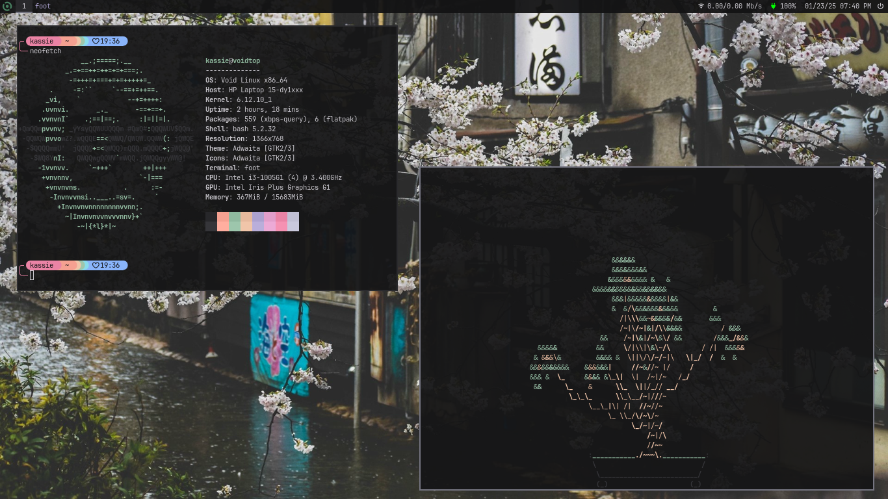

# System Configuration
Hello and welcome to the home of my personal system configuration that I use daily!

## About The Setup
My current daily-driver/EDC is an HP laptop (Model: 15-dy1074nr) running `void-linux-x86_64-musl`, built from a minimal install (as god intended). The end result is a sleek, minimal desktop in [river](https://codeberg.org/river/river), the dynamic tiling wayland compositor written in zig.

## Programs/Dependencies
There are quite a few of packages that are dependencies of dependencies, but the most pivotal are:
- [brightnessctl](https://github.com/Hummer12007/brightnessctl)
- [foot](https://codeberg.org/dnkl/foot/)
- [fuzzel](https://codeberg.org/dnkl/fuzzel)
- [grim](https://sr.ht/~emersion/grim/)
- [lazygit](https://github.com/jesseduffield/lazygit)
- [libnotify](https://gitlab.gnome.org/GNOME/libnotify)
- [mako](https://github.com/emersion/mako)
- [mpv](https://github.com/mpv-player/mpv)
- [pamixer](https://github.com/cdemoulins/pamixer)
- [playerctl](https://github.com/altdesktop/playerctl)
- [slurp](https://github.com/emersion/slurp)
- [starship](https://github.com/starship/starship)
- [swww](https://github.com/LGFae/swww)
- [wl-clipboard](https://github.com/bugaevc/wl-clipboard)
- [yambar](https://codeberg.org/dnkl/yambar)
- [yazi](https://github.com/sxyazi/yazi)

## Neovim
I've used [Neovim](https://github.com/neovim/neovim) for a few years now, and although the program on it's own is superb, its strong suit is in it's plugins. There are countless Neovim configurations online; you can find mine in the `/nvim/` directory of this repo.

